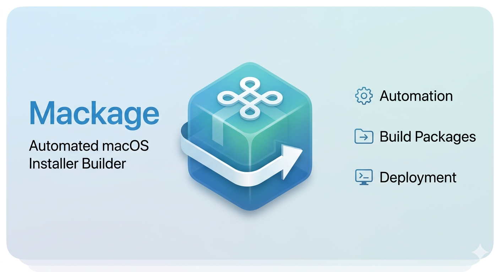

# mackage



`mackage` is a Python wrapper around Apple's `pkgbuild` and `productbuild` tools
that builds a fully-formed macOS `.pkg` installer from a single JSON
configuration file. It handles payload staging, install scripts, LaunchDaemon
plist generation, installer-UI resources, distribution XML generation, and
optional code signing.

## Requirements

- macOS (`pkgbuild` and `productbuild` are Apple-only tools)
- Python 3.9+
- Xcode Command Line Tools (`xcode-select --install`)
- A "Developer ID Installer" identity in your keychain (only required for
  signed/notarizable packages)

## Installation

`mackage` is a single self-contained script. Drop it somewhere on your `PATH`
and ensure it is executable:

```bash
chmod +x mackage
cp mackage /usr/local/bin/
```

## Usage

```bash
mackage <config.json> [--output-dir DIR] [--sign IDENTITY] [--identifier ID] [--keep-staging]
```

### Arguments

| Flag                | Description                                                                                           |
| ------------------- | ----------------------------------------------------------------------------------------------------- |
| `config.json`       | Path to a JSON configuration file (see schema below).                                                 |
| `--output-dir`, `-o`| Directory to write the final `.pkg` into. Defaults to the current directory.                          |
| `--sign IDENTITY`   | Sign the package with the given Developer ID Installer identity, e.g. `"Developer ID Installer: Acme (TEAMID)"`. |
| `--identifier ID`   | Override the reverse-DNS bundle identifier. Defaults to `com.company.<package>`.                      |
| `--keep-staging`    | Keep the temporary staging directory after building (useful for debugging).                           |

### Examples

Build an unsigned package:

```bash
mackage myapp.json --output-dir ./dist
```

Build a signed package:

```bash
mackage myapp.json \
    --output-dir ./dist \
    --sign "Developer ID Installer: Acme Corp (ABCD123456)"
```

## JSON Configuration Schema

### Required keys

| Key       | Type                       | Description                                                                              |
| --------- | -------------------------- | ---------------------------------------------------------------------------------------- |
| `package` | string                     | Package name. Letters, digits, dots, hyphens, and underscores only.                      |
| `version` | string                     | Version string, e.g. `"1.0.0"` or a date like `"2026-05-17"`.                            |
| `payload` | list of `{src, dest}`      | Non-empty list of files to install. `src` is the source path on the build machine; `dest` is the absolute install path on the target machine. |

### Optional keys

| Key                  | Type     | Description                                                                                       |
| -------------------- | -------- | ------------------------------------------------------------------------------------------------- |
| `preinstall_script`  | string   | Path to a script that runs before the payload is installed.                                       |
| `postinstall_script` | string   | Path to a script that runs after the payload is installed.                                        |
| `plist`              | string   | Path to a LaunchDaemon plist. If omitted, a minimal plist is auto-generated for the first payload entry and installed to `/Library/LaunchDaemons/`. |
| `config`             | string   | Path to a custom `distribution.xml`. If omitted, one is auto-generated.                           |
| `resources`          | object   | Installer-UI assets. See below.                                                                   |

### `resources` object

| Key              | Description                                                |
| ---------------- | ---------------------------------------------------------- |
| `welcome`        | Path to a welcome HTML page shown by the installer.        |
| `license`        | Path to a license HTML page shown by the installer.        |
| `background_img` | Path to a PNG background image for the installer window.   |

All paths in the JSON may be absolute or relative to the directory containing
the JSON config.

### Example

```json
{
  "package": "MyApp",
  "version": "1.0.0",
  "preinstall_script": "scripts/preinstall.sh",
  "postinstall_script": "scripts/postinstall.sh",
  "plist": "resources/com.example.myapp.plist",

  "resources": {
    "welcome": "resources/welcome.html",
    "license": "resources/license.html",
    "background_img": "resources/background.png"
  },

  "payload": [
    {
      "src": "build/myapp",
      "dest": "/usr/local/bin/myapp"
    },
    {
      "src": "build/myapp.conf",
      "dest": "/etc/myapp/myapp.conf"
    }
  ]
}
```

See the [`samples/`](samples/) directory for additional examples.

## How it works

1. Validates the JSON config.
2. Creates a temporary staging tree mirroring the on-disk layout of the
   target machine.
3. Copies each payload entry into the staging tree, preserving the executable
   bit when set on the source.
4. Stages optional `preinstall` / `postinstall` scripts (renamed as required
   by `pkgbuild`) and marks them executable.
5. Stages installer-UI resources (welcome, license, background).
6. Generates a default LaunchDaemon plist if none is supplied.
7. Runs `pkgbuild` to produce a component package.
8. Generates a `distribution.xml` if none is supplied.
9. Runs `productbuild` to produce the final product package, signing it
   when `--sign` is given.
10. Cleans up the staging directory (unless `--keep-staging` is set).

## Signing and notarization

When `--sign` is supplied, `mackage` runs `pkgutil --check-signature` against
the resulting package and prints the commands needed to notarize and staple
it:

```bash
xcrun notarytool submit MyApp-1.0.0.pkg \
    --apple-id you@example.com \
    --team-id YOURTEAMID \
    --password @keychain:AC_PASSWORD \
    --wait

xcrun stapler staple MyApp-1.0.0.pkg
```

## License

See [LICENSE](LICENSE).
